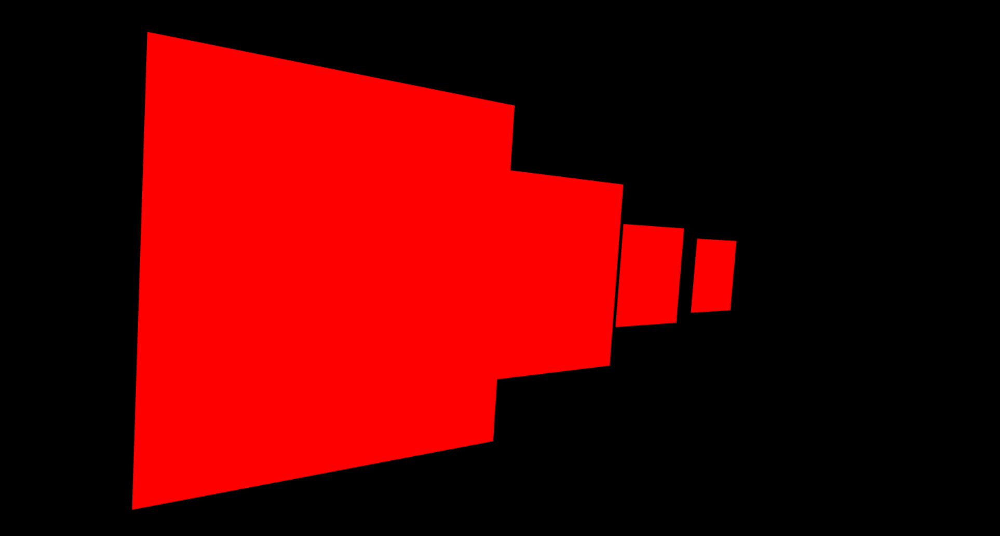

# rectangle
### modeling a rectangle using webGL while optimizing vertices stored on the GPU by using the element array buffer to only store unique vertices and referencing them by using an index buffer. 

